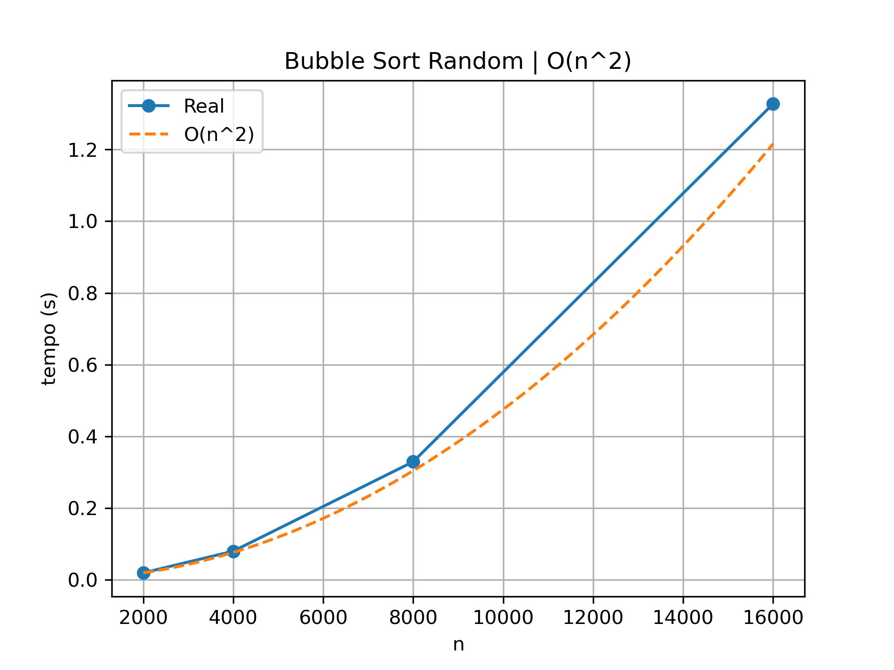

# Algorithm Complexity Analyzer (Analisador de Complexidade)

Autor: Augusto César da Silva Carvalho

Este projeto é uma ferramenta em C++ projetada para estimar a complexidade assintótica (Big O) de algoritmos de forma empírica.
Através da execução repetida de uma função com diferentes tamanhos de entrada, a ferramenta coleta dados de tempo e utiliza modelos 
estatísticos para inferir qual curva de crescimento melhor descreve o comportamento do algoritmo. 

---

## Funcionalidades

- Análise Empírica: Mede o tempo real de execução para diferentes tamanhos de $N$.
- Configuração de Precisão: Oferece três modos de velocidade (fast, normal, slow) que equilibram tempo de teste e precisão.
- Tipos de Entrada: Permite testar algoritmos com vetores ordenados, invertidos ou aleatórios (útil para analisar Melhor Caso, Pior Caso e Caso Médio).
- Exportação de Dados: Gera arquivos .csv para plotagem de gráficos.

---

## Métodos Matemáticos Utilizados

O motor de inferência da classe Complexity_Analyzer baseia-se em dois pilares estatísticos principais:

1. Cálculo de Inclinação (Slope) para $O(1)$
   
   Antes de testar modelos complexos, o analisador verifica se o tempo de execução é constante.
   - Fórmula: $\frac{\Delta t}{\Delta n} = \frac{time[i] - time[i-1]}{n[i] - n[i-1]}$
   - Se a média das inclinações for inferior a um limiar crítico ($1e-9$), o algoritmo é classificado como $O(1)$.

3. Teste de Modelos via Coeficiente de Variação (CV)
   
   Para distinguir entre $O(n)$, $O(n \log n)$, $O(n^2)$, etc., o código utiliza o princípio de que, se um algoritmo pertence a uma complexidade $f(n)$, então a razão entre o tempo de execução e a função teórica deve ser constante:
   
   $$\text{Razão} (R) = \frac{T(n)}{f(n)} \approx \text{Constante}$$

   O algoritmo testa várias funções candidatas ($f(n) = n, n^2, \log n \dots$) e calcula o Coeficiente de Variação para cada uma.
   - Média ($\mu$): $\bar{R} = \frac{1}{k} \sum R_i$
   - Variância ($\sigma^2$): $\frac{\sum (R_i - \bar{R})^2}{k}$
   - Coeficiente de Variação: $CV = \frac{\sigma}{\mu}$
   
   Critério de Decisão: O modelo que apresentar o menor CV é escolhido. Um CV baixo indica que os dados coletados "encaixam-se" quase perfeitamente na curva teórica testada.

---

## Como Usar

> [!WARNING]
> Pré-requisitos: Compilador C++17 ou superior.

Como funciona a chamada do método:

O método analyze recebe: 

```cpp
analyze(func, input_type, speed, filename, folder)
```

1. `func` (obrigatório)

   Uma função (ou lambda) que recebe um `std::vector<int>&`:
  
    ```
    [](std::vector<int> &v) {
        bubble_sort(v);
    }
    ```
2. `InputType` (opcional)
  
   Define como o vetor de entrada será gerado:
  
   ```cpp
    InputType::sorted    // vetor ordenado crescente
    InputType::reversed  // vetor ordenado decrescente
    InputType::random    // valores aleatórios
   ```

3. `Speed` (opcional)
  
   Controla o equilíbrio entre velocidade e precisão:
  
   ```cpp
   Speed::fast
   Speed::normal
   Speed::slow
   ```
  
   | Modo   | Tempo  | Precisão |
   | ------ | ------ | -------- |
   | fast   | rápido | menor    |
   | normal | médio  | boa      |
   | slow   | lento  | maior    |

4. `filename` e `folder` (opcionais)

   Nome do arquivo .csv que será gerado e seu diretório, ambos são opcionais e por padrão, 
   caso um nome de arquivo não seja enviado nos parâmetros, não será gerado nenhum arquivo no final do processo, e
   caso nao seja especificado uma pasta, uma será gerada com o nome de "results".

### Exemplo de uso:

```cpp
#include "your_algorithm.hpp"

auto complexity_b_sort_rand = com.analyze(
    [](std::vector<int> &v) {
        bubble_sort(v);
    },
    InputType::random,
    Speed::fast,
    "bubble_sort_random.csv"
);
```

A biblioteca a ser analisada tambem deverá ser incluída no arquivo `complexity-analyzer.hpp`

```cpp
#include "your_algorithm.hpp" // <---- deverá ser colocada dentro do arquivo complexity-analyzer.hpp
```

### Como compilar

Para compilar o projeto, utilize o `g++`:

- No Linux:

  ```bash
  g++ -std=gnu++17 -Wall -Wextra -O2 src/*.cpp -I include -o output/main
  ```
- No Windows (PowerShell):

  ```powershell
  g++ -std=gnu++17 -Wall -Wextra -O2 src/*.cpp -I include -o output/main.exe
  ```

---

## O que é gerado?

1. Saída no Console
O método analyze retorna uma string representando a notação Big O estimada, tais como:

- `O(n log n)`
- `O(n)`
- `O(n^2)`
- `O(n^3)`
- `O(1) or O(log n)` (devido à proximidade estatística em amostras pequenas).

2. Arquivo CSV

Se um nome de arquivo for fornecido, a pasta results/ conterá um arquivo com a seguinte estrutura:

```csv
n,time,complexity
2000,0.0189995,O(n^2)
4000,0.079499,O(n^2)
8000,0.328999,O(n^2)
16000,1.3275,O(n^2)
```

Neste repositório também acompanha uma main com alguns exemplos de algoritmos de ordenação e busca,
os arquivos CSV gerados, um notebook em python com uma função plotadora, e os plots desses algoritmos.

Exemplo de plot:



---

## Limitações e Observações

1. Ruído de Sistema: Processos em segundo plano no computador podem afetar as medições de tempo. O modo Speed::slow mitiga isso realizando mais repetições.
2. Precisão: Algumas complexidades como $O(\log n)$ podem ser confundidas com $O(1)$ se os tamanhos de $N$ não forem grandes o suficiente ou se a função for extremamente rápida.
3. Complexidades Exponenciais: O analisador atual foca em complexidades polinomiais e logarítmicas. Complexidades como $O(2^n)$ ou $O(n!)$ não são detectadas automaticamente pelo motor de cálculo de CV, embora os enums existam para expansão futura.
4. Melhor/Pior Caso: Algoritmos como o QuickSort variam drasticamente dependendo do InputType. Certifique-se de testar com random e sorted para uma visão completa.
5. Memória: Para testes slow, certifique-se de ter memória RAM disponível para os vetores de tamanho 320.000.


